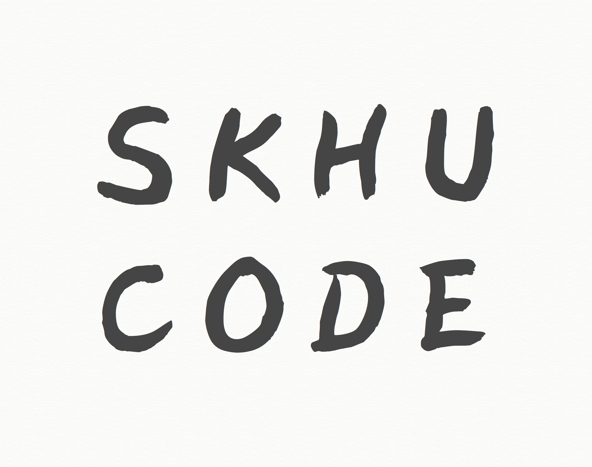

# SKHUCODE 😁

> 성공회대학교 알고리즘/자료구조 스터디 모임입니다 :)

---

## 스터디 방식

- 매주 1회 모여 서로의 코드를 공유하고 피드백을 받습니다.
- 기본적으로 Java 언어를 사용하여 코드를 작성합니다.
- [Github Organization](https://github.com/skhucode)을 통해 코드를 공유합니다. | [공유방식](https://github.com/skhucode/skhucode-main/blob/master/github-review.md)
- 추가적으로 필요한 자료는 Google Drive를 이용합니다.

## 인원구성

- [이예지](https://github.com/yjll1019)
- [이혜지](https://github.com/lwiiiiii)
- [김지혜](https://github.com/KimJye)
- [최태훈](https://github.com/choitaehoon)
- [김지은](https://github.com/kje6445)
- [최인혁](https://github.com/inhyuck)

## 역할분담

- 회계 - 이예지
- 장소 대여 - 최태훈
- 스케줄 조정 - 김지혜
- 회의록 정리 - 이혜지

## [회계문서](https://drive.google.com/drive/folders/1FddQwMZWURVWnUAG2D4OnJAouA35-aNw?usp=sharing)

## 회칙

1. 우리만 잘 되자고 하는 스터디가 아닙니다. 다른 사람들도 도움을 얻을 수 있다는 생각으로 자료를 잘 정리합니다.
2. 스터디 첫 모임때 1000원 x 회차 수 만큼 돈을 걷고 **사유불문** 지각시 -500원  결석시 -1000원 차감됩니다.
3. 규칙은 반드시 구성원간의 합의에 의해서 결정됩니다.

